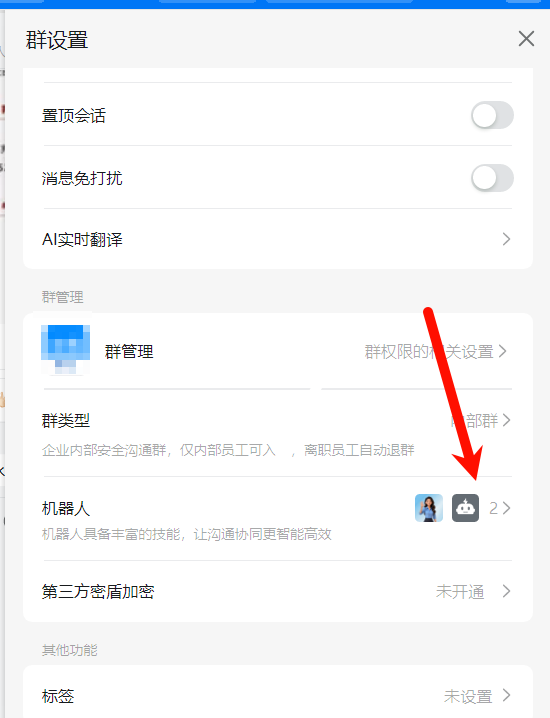
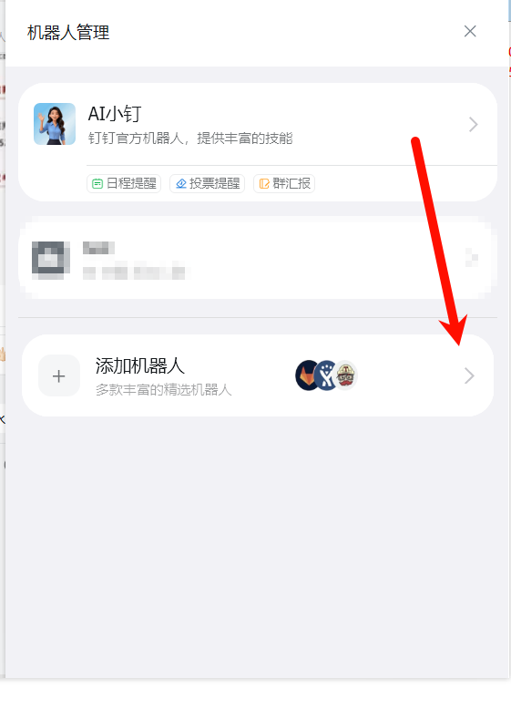

# 钉钉每日推送脚本

## 1. 项目概述

用于向钉钉群发送定时推送消息，支持根据时间段自动切换推送内容。

## 2. 环境准备

### 安装依赖
```bash
pip install dingtalkchatbot
```

### 目录结构
```
├── Ding_talk_every_day.py    # 主程序
├── config/                   # 配置目录
│   ├── config.json           # 默认配置
│   ├── config_festival.json  # 特殊时段配置示例
│   ├── image.txt             # 默认图片URL
│   ├── image_festival.txt    # 特殊时段图片URL示例
│   └── schedule_config.json  # 时间段配置
└── logs/                     # 日志目录
```

## 3. 配置文件说明

### 3.1 默认配置 (config.json)

```json
[
  {
    "webhook": "https://oapi.dingtalk.com/robot/send?access_token=xxx",
    "secret": "xxx",
    "template": "##### 内容模板",
    "title": "每日推送",
    "at_mobiles": [],
    "is_at_all": false,
    "send_type": "markdown_with_image",
    "placeholders": ["{IMAGE_URL}", "{IMG2}"]
  }
]
```

**参数：**
- `webhook`：机器人Webhook地址（必填）
- `secret`：加签密钥（可选）
- `template`：推送内容模板
- `title`：消息标题
- `at_mobiles`：@的手机号列表
- `is_at_all`：是否@所有人
- `send_type`：发送类型（可选，默认：markdown_with_image）
  - `markdown_with_image`：带图片的Markdown
  - `markdown`：纯Markdown（不处理图片）
  - `text`：纯文本（不处理图片）
- `placeholders`：图片占位符列表（可选，默认：["{IMAGE_URL}"]）
  - 当`send_type`为`markdown_with_image`时生效
  - 会替换模板中所有出现的占位符

### 3.2 时间段配置 (schedule_config.json)

```json

{
  "schedules": [
    {
      "name": "牛马也要放假",
      "specific_dates": ["2024-02-08", "2024-02-17"],      // 特殊日期，优先级高于日期范围
      "start_date": "2026-02-18",                          // 时间格式为YYYY-MM-DD
      "end_date": "2026-02-24",                            // `start_date/end_date必须同时存在且有效`
      "config_file": "config_festival.json",
      "image_file": "image_festival.txt"
    },
    {
      "name": "开启牛马生活",
      "specific_dates": ["2026-02-25"],
      "config_file": "config_festival.json",  
      "image_file": "image_festival.txt"
    }
  ],
  "default": {
    "config_file": "config.json",
    "image_file": "image.txt"
  }
}

```

**参数：**
- `name`：时间段名称
- `start_date`/`end_date`：日期范围（格式：YYYY-MM-DD） 
- `specific_dates`：特定日期列表（可选）
- `config_file`：该时段使用的配置文件
- `image_file`：该时段使用的图片文件

### 3.3 图片文件 (image.txt)

每行一个图片URL（HTTPS协议，支持jpg/png/gif/webp）：
```
https://example.com/image1.jpg
https://example.com/image2.jpg
```

## 4. 使用方法

### 运行脚本
```bash
python Ding_talk_every_day.py
```

### 定时任务设置

可直接设置为Windows定时任务，脚本会自动切换到正确目录。

## 5. 高级功能

### 5.1 多占位符替换

支持在模板中使用多个不同的图片占位符：

```json
{
  "webhook": "xxx",
  "secret": "xxx",
  "template": "### 多图推送\n\n\n
  "title": "多图推送",
  "send_type": "markdown_with_image",
  "placeholders": ["{MAIN_IMG}", "{IMG1}", "{IMG2}"]
}
```

### 5.2 不同发送类型

**带图片的Markdown：**
```json
{"send_type": "markdown_with_image", "template": "内容"}
```

**纯Markdown：**
```json
{"send_type": "markdown", "template": "纯markdown内容，不包含图片"}
```

**纯文本：**
```json
{"send_type": "text", "template": "纯文本消息，不包含图片"}
```

### 5.3 自定义时间段推送

1. 创建特殊配置文件（如`config_festival.json`）
2. 创建对应图片文件（如`image_festival.txt`）
3. 在`schedule_config.json`中添加配置

## 6. 代码更新日志

### v2.0 主要更新

1. **多占位符支持**
   - 新增 `placeholders` 配置项，支持替换模板中的多个占位符
   - 更新 `send_markdown_with_image` 方法，实现遍历替换所有占位符

2. **多发送类型支持**
   - 新增 `send_type` 配置项，支持三种发送类型
     - `markdown_with_image`：带图片的Markdown
     - `markdown`：纯Markdown
     - `text`：纯文本

3. **配置默认值**
   - 新增 `DEFAULT_PLACEHOLDERS` 和 `DEFAULT_SEND_TYPE` 常量
   - 在配置验证时自动添加默认值

4. **错误修复**
   - 修复了语法错误（移除错误的"git"字符串）
   - 优化了日志输出格式

5. **功能优化**
   - 当模板中没有占位符时，自动将图片添加到末尾
   - 根据发送类型选择不同的处理逻辑
   - 改进了配置文件加载和验证

## 7. 常见问题

- **图片无法显示**：检查是否为HTTPS协议，是否使用允许的域名
- **消息发送失败**：检查Webhook和密钥是否正确
- **占位符不替换**：检查占位符是否在 `placeholders` 列表中
- **时间段不生效**：检查日期格式是否为YYYY-MM-DD

## 8. 注意事项

- 脚本每次运行会使用并删除图片文件中的第一张图片URL
- 确保配置文件中的敏感信息安全
- 大量发送可能触发限流，建议合理安排频率
- 当 `send_type` 为 `markdown` 或 `text` 时，不处理图片占位符
- 如果 `placeholders` 为空列表，图片会自动追加到模板末尾


> [!TIP] 
>
> 注：本脚本已经设置了 自动 cd切换到 当前py文件目录下，故可直接设置为windows定时任务 
>
> 


### ==钉钉机器人申请步骤如下：==

---


## 1.



### 2



### 3


### 4

